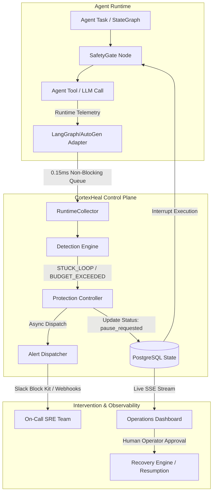
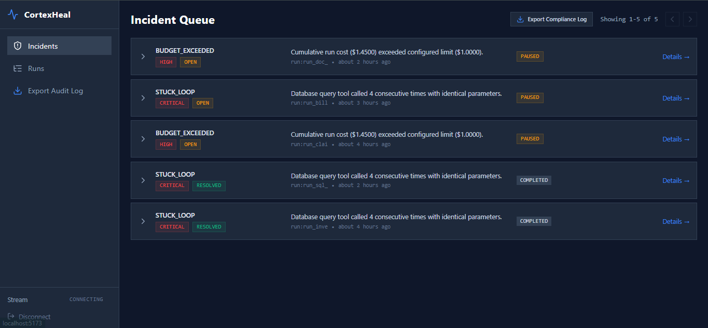
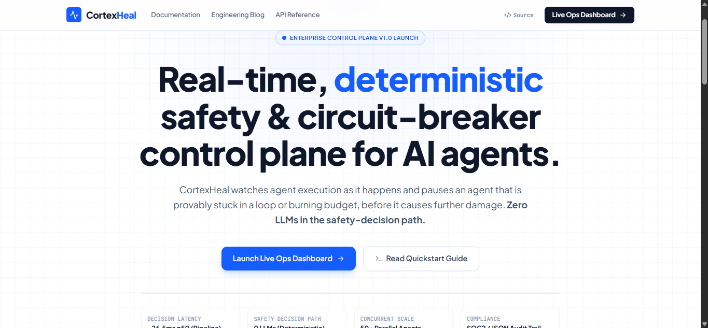

# CortexHeal

[](LICENSE)
[](pyproject.toml)
[-emerald.svg)](#why-cortexheal)
[](#quickstart)

> **Real-time, deterministic safety and circuit-breaker control plane for AI agents.**

CortexHeal watches AI agent execution as it happens and automatically pauses agent threads that are provably stuck in a loop or exceeding budget ceilings—preventing runaway cloud bills and infinite tool cycles before damage occurs.

---

## Why CortexHeal?

When AI agents run autonomously in production, they inevitably encounter unexpected edge cases:
- **Infinite Tool Loops**: An agent repeatedly queries an empty database or malformed endpoint with identical arguments, burning compute and API limits.
- **Runaway Token Costs**: A stuck plan or recursive sub-agent chain burns hundreds of dollars in seconds across frontier model APIs.

### The Deterministic Imperative (Zero LLMs in the Safety Loop)
Most observability tools attempt to solve agent safety by introducing a secondary **"LLM-as-a-Judge"**. This introduces three critical flaws:
1. **Compounding Latency**: Calling an LLM at every step adds 400ms–2,500ms of latency per tool call.
2. **Probabilistic Rulings**: An LLM judge can hallucinate, flip verdicts across identical states, or be jailbroken by the agent's own context.
3. **Cascading Failure**: When the LLM provider experiences an outage, the safety system fails simultaneously.

**CortexHeal uses 100% deterministic evaluation**:
- **O(1) SHA-256 Canonical Fingerprinting**: Tool arguments and normalized outputs are hashed and tracked in in-memory ring buffers.
- **Mathematical Threshold Bounds**: Strict token usage, cost accumulation, and repetition limits trip instantly without model inference.
- **Sub-Millisecond Ingest Handover**: 0.15ms queue handover to prevent blocking agent runtime threads.

---

## Architecture

CortexHeal separates the **Safety Decision Path** (fast, deterministic, zero LLMs) from the **Recovery Planning Path** (diagnostic suggestions with human sign-off):



---

## Screenshots


*Figure 1: Real-time incident queue showing paused agent runs, deterministic root-cause detections, and severity classification.*


*Figure 2: CortexHeal control plane overview, interactive architecture documentation, and live operations access.*

---

## Quickstart

### 1. Start Infrastructure & Server
```bash
# Clone repository
git clone https://github.com/Ashitpatel001/CortexHeal.git cortexheal
cd cortexheal

# Start PostgreSQL container
docker compose up -d

# Install Python package in editable mode
pip install -e .

# Initialize schema & seed realistic demo workloads
python scripts/reseed_demo_data.py

# Start CortexHeal Control Plane API (port 8000)
uvicorn cortexheal.server.api:app --reload --port 8000
```

### 2. Attach SafetyGate to Your Agent (LangGraph Example)
```python
from cortexheal import CortexHeal
from cortexheal.adapters.langgraph import LangGraphAdapter
from langgraph.graph import StateGraph, END

# 1. Initialize adapter and safety control plane
adapter = LangGraphAdapter(agent_id="customer_support_agent")
cortex = CortexHeal(adapter=adapter)

# 2. Add SafetyGate node as the entry point of your StateGraph
builder = StateGraph(AgentState)
builder.add_node("safety_gate", cortex.safety_gate)
builder.add_node("agent_worker", worker_node)

builder.set_entry_point("safety_gate")
builder.add_edge("safety_gate", "agent_worker")
builder.add_edge("agent_worker", "safety_gate")

graph = builder.compile()
```

For AutoGen adapter guides, see the [Full Documentation](docs/ADAPTER_ARCHITECTURE.md).

---

## Key Features

- **Deterministic Circuit Breaking**: Automatic `STUCK_LOOP` detection (>= 4 repetitive argument/response hashes) and `BUDGET_EXCEEDED` limits ($1.00 run ceiling).
- **Multi-Tenant Security & RBAC**: SHA-256 hashed API keys with strict `VIEWER`, `OPERATOR`, and `ADMIN` role boundaries and tenant isolation by `org_id`.
- **Async Outbound Alerting**: Slack Block Kit alerts with automated background escalation polling for unacknowledged incidents.
- **Compliance Audit Export**: Streaming JSON and CSV compliance export endpoints (`GET /api/audit/export`) for SOC2 / ISO 27001 audit trails.
- **Live Event Stream**: Real-time Server-Sent Events (SSE) stream (`GET /api/stream`) for sub-second UI updates without client polling.
- **Human-in-the-Loop Resumption**: Stalled agents safely pause in-graph and resume only after operator sign-off or validated recovery plans.

---

## Verified Scale Benchmarks

Tested with **55 concurrent in-process LangGraph agents** running simultaneously against **55 persistent SSE streams**:

| Metric | Measured Value | Scope / Boundary |
| :--- | :---: | :--- |
| **Telemetry Queue Handover (p50)** | **0.15 ms** | Agent thread non-blocking queue push |
| **Telemetry Queue Handover (p95)** | **0.34 ms** | Agent thread non-blocking queue push |
| **Full Pipeline Circuit-Break (p50)** | **~26.5 ms** | Ingest &rarr; Postgres insert &rarr; Detector math &rarr; Pause update |
| **Full Pipeline Circuit-Break (p95)** | **~94.0 ms** | 55-agent simultaneous burst under load |
| **Full Pipeline Circuit-Break (p99)** | **~240.0 ms** | Tail connection acquisition & commit |
| **Event Loss Rate** | **0.0%** | Zero dropped events across all concurrent runs |

---

## Tech Stack

| Layer | Technologies |
| :--- | :--- |
| **Control Plane API** | Python 3.11, FastAPI, Pydantic v2, Uvicorn |
| **Database & Pooling** | PostgreSQL 16, ThreadedConnectionPool (max=100), SQLAlchemy |
| **Observability** | Prometheus Client (`/metrics`), Python Logging (Structured JSON) |
| **Dashboard UI** | React 19, TypeScript, Vite, Tailwind CSS v4, Lucide React |
| **Marketing & Docs** | React 19, Tailwind CSS v4, React Router 7 |
| **Testing** | Pytest, Pytest-Asyncio, HTTPX, Puppeteer |

---

## Testing

CortexHeal includes a multi-tier test suite covering unit tests, adversarial safety boundaries, concurrent scale tests, and full lifecycle end-to-end scenarios.

```bash
# Run complete test suite
pytest tests/ -v

# Run 55-agent concurrent scale test
python tests/load/run_concurrent_scale_test.py

# Run end-to-end multi-agent launch scenario
pytest tests/e2e/test_full_launch_scenario.py -v
```

---

## Contributing

Contributions are welcome! Please feel free to submit a Pull Request.

1. Fork the repository
2. Create your feature branch (`git checkout -b feature/new-detector`)
3. Commit your changes (`git commit -m 'Add custom rate limit detector'`)
4. Push to the branch (`git push origin feature/new-detector`)
5. Open a Pull Request

---

## License

Distributed under the **Apache 2.0 License**. See [`LICENSE`](LICENSE) for more information.