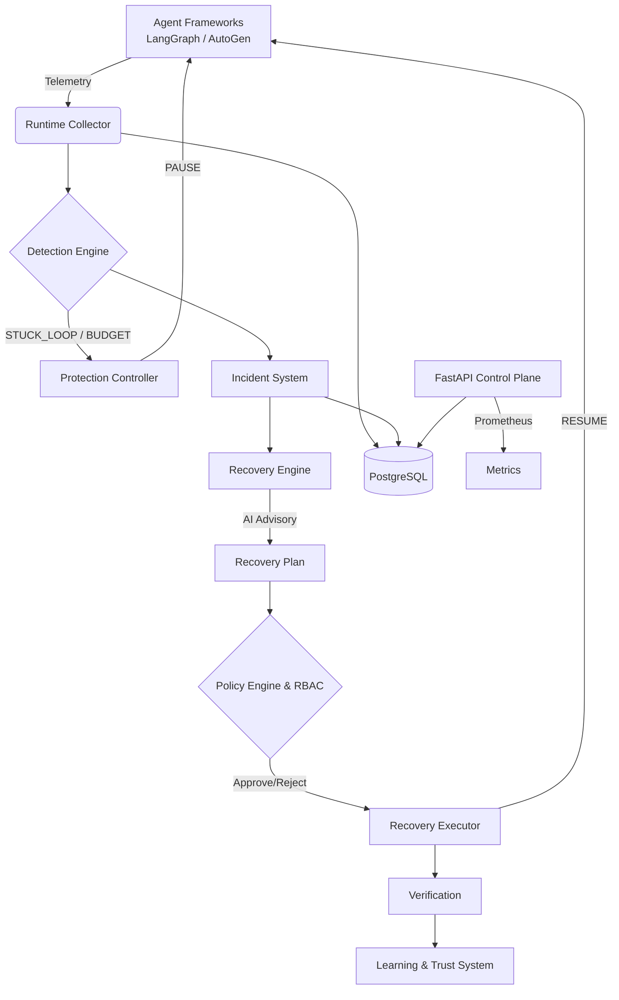

# CortexHeal

*Deterministic Safety and Self-Healing for AI Agents*

CortexHeal is a deterministic detection engine and self-healing platform for AI agents. It provides a safe, observable control plane to protect autonomous systems from execution failures, recursive tool loops, and runaway costs without relying on non-deterministic language models for critical authorization.

## Problem

AI agents frequently fail in unpredictable ways: they get stuck in infinite recursive loops repeating the same tool calls, encounter unrecoverable API failures requiring human intervention, and quickly exhaust financial budgets. Traditional recovery attempts rely entirely on the AI prompting itself to fix the problem, which often leads to unsafe, unconstrained execution or further hallucination without safe automated recovery limits.

## Solution

CortexHeal implements a deterministic, multi-stage workflow to protect and recover agents safely:

```text
Agent -> Observe -> Detect -> Protect -> Incident -> Analyze -> Recovery Plan -> Policy / RBAC -> Execute -> Verify -> Learn
```

## Architecture



- **Framework adapters**: Native integrations intercepting state graphs and agents.
- **Runtime collector**: Async bounded queue providing non-blocking telemetry ingestion.
- **Detection engine**: Deterministic, O(1) matching for execution failures.
- **Protection controller**: Intercepts framework execution to safely pause agents.
- **Incident system**: State machine tracking failures and recovery status.
- **Recovery engine**: Analyzes incidents to formulate safe recovery plans.
- **Policy engine**: Programmatic rules engine governing safe automation.
- **Recovery executor**: Applies approved plans to the paused agent.
- **Verification**: Confirms if the agent actually recovered post-resume.
- **Learning/trust system**: Adjusts confidence scores based on verified recovery outcomes.
- **FastAPI control plane**: Secure API endpoints and real-time streaming.
- **PostgreSQL**: Single source of truth for persistent audit trails.
- **Prometheus metrics**: Exposes ingestion latency, queue depth, and agent run metrics.

## Key Features

- Deterministic `STUCK_LOOP` and `BUDGET_EXCEEDED` detection.
- Safe `PAUSE`/`RESUME` framework execution interception.
- AI-assisted recovery planning securely separated from execution.
- Policy-driven approval workflow for safe automation.
- Role-Based Access Control (RBAC) via API tokens.
- Server-Sent Events (SSE) for real-time dashboard monitoring.
- High-performance, low-overhead telemetry ingestion scaling past 80,000 events/sec.

## Safety Model

- **AI = advisory**: The AI recommends recovery steps but never authorizes them.
- **Policy = authoritative**: Deterministic rules govern what is allowed.
- **RBAC = authorization boundary**: Humans or strict policies authorize the Executor.
- **Executor = constrained actions**: Applies only strictly defined interventions (PAUSE/RESUME/KILL).
- **Verification = determines whether recovery succeeded**: Monitors telemetry post-resume to verify the fix.

The AI cannot simply execute arbitrary commands; it only suggests predefined, safe state mutations that must pass the programmatic policy engine before execution.

## Supported Frameworks

- **LangGraph**: Native integration capturing state graphs, tool calls, and LLM cycles.
- **AutoGen**: Safely intercepts `ConversableAgent` execution via native hooks.

## Failure Detection

CortexHeal utilizes a deterministic `STUCK_LOOP` detection mechanism. It calculates cryptographic hashes of tool names, arguments, and responses. If an agent repeats the exact same tool invocation with identical parameters and results beyond a defined threshold (e.g., 5 times), the engine instantly detects a failure without relying on LLM interpretation.

## Recovery Lifecycle

**Successful:**
`STUCK_LOOP` -> `PAUSE` -> `APPROVAL` -> `RESUME` -> `RUN_COMPLETED` -> `RECOVERY_VERIFIED`

**Failed:**
`STUCK_LOOP` -> `PAUSE` -> `APPROVAL` -> `RESUME` -> `STUCK_LOOP` -> `RECOVERY_REPEATED_FAILURE` -> `PAUSE`

## Quick Start

### 1. Python Environment
```bash
python -m venv venv
.\venv\Scripts\activate
```

### 2. Installation
```bash
pip install -e .[langgraph,autogen,dev]
```

### 3. Configuration
```bash
cp .env.example .env
```

### 4. PostgreSQL via Docker
```bash
docker compose up -d
```

### 5. Alembic Migrations
```bash
alembic upgrade head
```

### 6. Starting the API
```bash
uvicorn cortexheal.server.api:app --host 0.0.0.0 --port 8000
```

### 7. Health/Readiness Checks
```bash
curl http://localhost:8000/health
curl http://localhost:8000/readiness
```

### 8. Running the Example Agents
```bash
python examples/manual_healthy_run.py
```

## Examples

The `examples/` directory contains verified demonstrations of the core behavior:
- `manual_healthy_run.py`: Demonstrates an agent completing a task without issues.
- `manual_stuck_loop.py`: Demonstrates the `STUCK_LOOP` detector intercepting and pausing a runaway agent.
- `manual_recoverable_loop.py`: Demonstrates an agent being paused, receiving an approved recovery plan, resuming, and successfully completing its task.
- `manual_unrecoverable_loop.py`: Demonstrates an agent being paused, resuming, and immediately failing again, triggering `RECOVERY_REPEATED_FAILURE`.

## Testing

Run the test suite:
```bash
python -m pytest tests -v
```
*(Current Result: 61 tests collected, 61 passed)*

The test suite includes complete end-to-end (E2E) validation covering the full `PAUSE`/`RESUME` lifecycle, as well as performance testing verifying the `O(1)` overhead guarantee.

## Project Structure

```text
cortexheal/
├── adapters/      # Framework integrations (LangGraph, AutoGen)
├── detection/     # Deterministic STUCK_LOOP and BUDGET engines
├── protection/    # Execution interception (PAUSE/RESUME)
├── recovery/      # Planning, Policy, and Execution
├── runtime/       # Async telemetry collector
├── server/        # FastAPI Control Plane and SSE
├── storage/       # PostgreSQL models and connection
└── telemetry/     # Prometheus metrics
```

## Configuration

Configuration is handled via environment variables (see `.env.example`). Important variables include:
- `DATABASE_URL`: PostgreSQL connection string (defaults to port 5433 for local Docker).
- `ADMIN_TOKENS`, `OPERATOR_TOKENS`, `VIEWER_TOKENS`: Authentication keys for RBAC.
- `MAX_QUEUE_SIZE`: Backpressure limit for the asynchronous telemetry collector.

## API / Control Plane

- `/health` & `/readiness`: Infrastructure and telemetry health checks.
- `/metrics`: Prometheus metrics endpoint.
- `/api/incidents` & `/api/runs`: Audit, pagination, and state tracking.
- `/api/runs/{run_id}/resume`: Operator endpoint to manually authorize agent resumption.
- `/api/stream`: Real-time Server-Sent Events (SSE) for dashboards.

## Security

- **Authentication**: Token-based via `X-API-Key` HTTP header.
- **RBAC**: Enforces Viewer, Operator, and Admin roles (only Operators/Admins can approve recovery).
- **Policy Enforcement**: Recovery plans are evaluated by a strict programmatic policy before execution.
- **Audit Trail**: Every execution, pause, resume, and incident is permanently recorded in PostgreSQL.
- **Safe Boundaries**: The system fails open. Database or telemetry backpressure failures will gracefully degrade without crashing the monitored agent.
- **Secret Handling**: Keys are managed entirely via `.env` and excluded from version control.

## Limitations

- CortexHeal currently relies exclusively on PostgreSQL (no alternative datastores).
- Framework integrations are strictly limited to LangGraph and AutoGen.
- Detection algorithms currently focus strictly on `STUCK_LOOP` and `BUDGET_EXCEEDED` (no semantic drift detection).
- Does not currently support Kubernetes, digital twins, multi-cloud deployments, or DevOps pipeline self-healing.

## Future Work

- Expansion to additional agent frameworks.
- Enhanced visual dashboards utilizing the existing SSE streaming capabilities.
- Additional deterministic detectors for specific API failure modes.

## Contributing

- All code must pass the 61-item test suite (`pytest tests -v`) and compile correctly (`python -m compileall cortexheal`).
- Safety-sensitive changes to the `DetectionEngine` or `ProtectionController` require careful benchmarking to preserve fail-open and `O(1)` overhead guarantees.
- Always run `alembic current` and `docker compose config` when adjusting schemas or infrastructure.

## License

MIT License