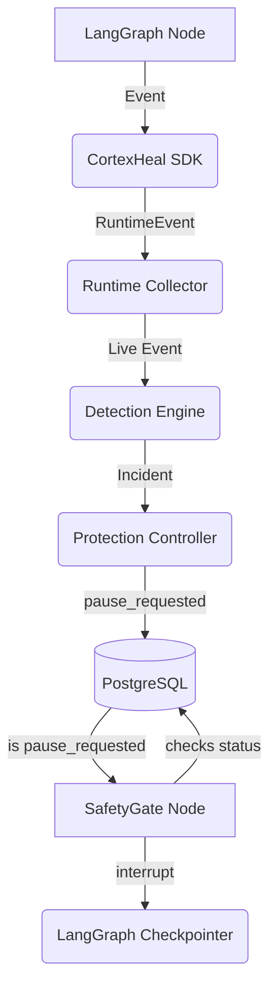

# CortexHeal V1 Architecture

## Overview
CortexHeal Protect V1 is a modular monolith built in Python, integrating seamlessly with LangGraph agents to provide non-intrusive runtime observation, deterministic loop detection, and safe execution pausing.

## System Components

### 1. Agent Runtime (LangGraph)
The host execution environment. Developers build their AI agents using standard LangGraph patterns.

### 2. CortexHeal SDK
- **`CortexHealLangGraphCallback`**: A lightweight callback handler injected into the graph's `callbacks`. It passively observes node execution, tool calls, and LLM calls, emitting deterministic `RuntimeEvent` objects.
- **`CortexHealSafetyGate`**: A standard LangGraph node inserted by the developer. It acts as the official execution boundary. If an incident triggers a pause, the safety gate formally calls `interrupt()`.

### 3. Runtime Collector
Receives streaming `RuntimeEvent` objects from the SDK, manages identity and sequence ordering, and persists them asynchronously to PostgreSQL.

### 4. Detection Engine
- A synchronous, deterministic, `O(1)` stateful engine.
- Evaluates live events against configured algorithms (e.g., `STUCK_LOOP`, `BUDGET_EXCEEDED`).
- Discards duplicate incidents immediately in-memory before database interaction.
- Generates `Incident` records with rich, verifiable JSON evidence.

### 5. Policy Gate & Protection Controller
- Receives generated `Incident` records.
- Evaluates configured policies (e.g., "Auto-pause on STUCK_LOOP").
- Validates state transitions (e.g., ensuring a completed run cannot be paused).
- Mutates the run status in PostgreSQL (e.g., `pause_requested`) and emits `AuditEvent` records.

### 6. Storage (PostgreSQL)
The central persistence layer containing:
- `runs`: Aggregated metadata and protection status.
- `events`: Ordered granular execution steps.
- `incidents`: Deduplicated failure records.
- `audit_events`: Tamper-evident trail of safety actions.

## Data Flow (Detection to Pause)

